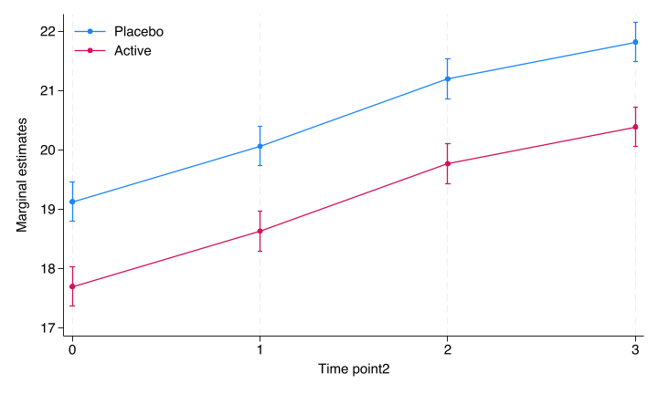
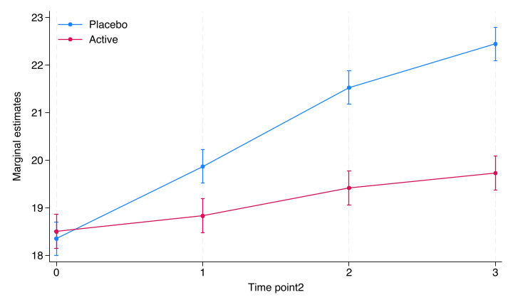

---
output:
  html_document: default
  pdf_document: default
---

```{r setup_02, include=FALSE}
knitr::opts_chunk$set(echo = TRUE)
library(haven)
library(tidyverse)
library(broom)
library(knitr)
library(purrr)
library(lme4)
library(marginaleffects)
library(Statamarkdown)
```
# Continuous endpoints

## Single follow-up
When the outcome consists of a single follow-up assessment of the continuous endpoint, the main method I use is Analysis of Covariance. According to the EMAs [Guideline on adjustment for baseline covariates in clinical trials](http://www.ema.europa.eu/docs/en_GB/document_library/Scientific_guideline/2015/03/WC500184923.pdf) we should adjust for site in multicentre trial, any stratification factors in the randomisation in addition to pre-specified covariates with evidence of strong or moderate association between the covariate and the primary outcome measure. Usually this also means the baseline observation of the outcome. In our simulated data set this means to adjust for `site`, `contbl` and `covar` variables. In this example we define that the primary outcome is the continuous outcome at time 3.

### Stata code


```{stata sancova1_02, engine.path='/usr/local/bin/stata-se', cache = TRUE, dependson = 'sim'}

use stata/rct, clear 
regress contout i.trt i.site covar contbl if time==3

```
Note that we here looked at the outcome at time 3 as the primary outcome. It does not matter if we use this or the change from baseline to time 3, due to the baseline adjustment:

```{stata sancova2_02, engine.path='/usr/local/bin/stata-se', cache = TRUE, dependson = 'sim'}
use stata/rct, clear 
gen diff = contout - contbl 
regress diff i.trt i.site covar contbl if time==3
```
We see that the only difference is that the baseline parameter estimate shifts with one unit. 

### R code

```{r rancova_02}
rct <- read_dta("stata/rct.dta") %>% 
  modify_at(c("trt","catout"), haven::as_factor, levels = "labels") %>% 
  modify_at(c("site","time"), haven::as_factor)
rct %>% 
  filter(time==3) %>%
  lm(contout ~ trt + site + covar + contbl, data=.) %>%
  summary
```

We see that the parameter estimates are identical. 


### Reporting
According to the [CONSORT Statement](consort-statement.org) item 17a: 
> For each outcome, study results should be reported as a summary of the outcome in each group (for example, the number of participants with or without the event and the denominators, or the mean and standard deviation of measurements), together with the contrast between the groups, known as the effect size. 

For the single follow-up we present the mean and standard deviaiton for the outcome in addition to the effect size at follow-up (time 3). There is some coding to get the format right, but the nice thing is that the table could be pasted directly into the article. There are many ways to program this, the below example is one way. 

```{r reporting_02}

#Two functions to produce the mean (sd) and est (lci to uci) output--------------------
get_meansd <- function(m, s, d=2){
  paste(round(m, digits=d)," (",round(s,digits=d),")")
}
get_estci <- function(e, l, u, d=2){
  paste(round(e, digits=d), " (", round(l, digits=d), " to ", round(u, digits=d),")")
}

# Compile the summary measures---------------------------------------------------------
single_cont_sum <- rct %>% 
  group_by(trt) %>% 
  filter(time==3) %>% 
  select(contout, trt) %>% 
  summarise_all(list(~mean(.),~sd(.))) %>% 
  mutate(txt1=get_meansd(mean,sd)) %>%
  select(trt,txt1) %>%
  spread(key=trt,value=txt1)

# Compile the estimates --------------------------------------------------------------
single_cont_est <- rct %>% 
  filter(time==3) %>%
  lm(contout ~ trt + site + covar + contbl, data=.) %>%
  tidy(conf.int=TRUE) %>%
  filter(term=="trtActive") %>%
  mutate(txt2=get_estci(estimate,conf.low,conf.high)) %>%
  select(term,txt2)

# Combine and produce the table -----------------------------------------------------
single_cont_sum %>% 
  bind_cols(single_cont_est) %>%
  mutate(txt="Outcome at time 3, mean (sd)") %>%
  select(txt,Active, Placebo, txt2) %>% 
  kable(col.names=c("Outcome", "Active", "Placebo", "Effect size with 95% confidence limits"))
```

## Repeated follow-up
When the measurements are repeated, I usually use mixed models to model the data. The challenge with mixed models is that the effect size can be estimated in several ways, depending on the model specification.

### Simple model
The simplest model is a model with random intercept and treatment, time and other baseline covariates as fixed effects.

$$ Y_{ij} =  \mu_j + A_i + \mu_{trt} + \mu_{strat} + a_1 X_1 +  \epsilon_{ij} $$

where $Y_{ij}$ is the contiuous outcome for individual $i$ at time $j$, $\mu_j$ is the overall mean at time $j$, $A_i$ is the random intercept for individual $i$, $\mu_{trt}$ is the mean treatment effect, $\mu_{strat}$ is the mean effect of strata, $a_1$ is the slope parameter of baseline covariate $X_1$, and $\epsilon_{ij}$ is the residual. The expression is sloppy, but should be readable. 

In Stata, this model is coded as

```{stata smixed1_02, engine.path='/usr/local/bin/stata-se', cache = TRUE, dependson = 'sim'}
use stata/rct, clear 
mixed contout i.trt i.site i.time covar || pid: 
```

In R this the model is coded as

```{r rmixed1_02}
rct %>%
  lmer(contout ~ trt + site + time + covar + (1|pid),data=., REML=FALSE) %>%
  summary(correlation=FALSE)
```
Note that we need to specify "REML=FALSE" to produce Maximum Likelihood estimates to be consistent with the Stata estimates. 

This is clearly not a good model since it assumes that the treatment effect is the same at all timepoints (including baseline). Since we should assume no treatment difference at baseline, the model is clearly wrong. We see this when we plot the model estimates through the "margins" and "marginsplot" procedures in Stata, and the "marginaleffects"-package in R. The "marginaleffects"-package is heavily influenced by Stata.  

<!-- Note that the Stata offers the best way to present the marginal estimates through the 'margins' and 'marginsplt' procedures. I have not been able to find R packages that integrates this in a similar consistent way, although the 'margins' R package delivers some of the functionality.   -->

```{stata smixed2_02, engine.path='/usr/local/bin/stata-se', results=TRUE, cache = TRUE, dependson = 'sim'}
use stata/rct, clear 
mixed contout i.trt i.site i.time covar || pid: 

*Compute the marginal estimates by time and treatment

margins time#trt

*Plot the marginal estimates. Note that the arguments after the comma is just to prettify the plot.

marginsplot, graphregion(color(white)) graphregion(color(white)) plotregion(color(white)) ytitle("Marginal estimates") ylabel(,nogrid)  legend(region(color(none) lstyle(none)) cols(1) ring(0) bplacement(nwest)) title("")
graph export stata/figures/cont_fig1.png, replace 
```

<!--  -->

```{r, fig.cap="Simple mixed model marginal plot from Stata"}

```

We will show how to code this in R below. The code is similar. 


### Model with treatment-time interaction

A better solution would be to add a treatment-time interaction to the mixed model to loosen the assumption that the treatment effect is equal across time. 

In Stata, the model is coded as:

```{stata smixed3_02, engine.path='/usr/local/bin/stata-se', cache = TRUE, dependson = 'sim'}
use stata/rct, clear 
mixed contout i.trt i.time i.trt#i.time i.site covar || pid: 
```

In R this model is coded as

```{r rmixed3_02, warning=FALSE}

rct %>%
  lmer(contout ~ trt + time + trt*time + site + covar + (1|pid),data=., REML=FALSE) %>%
  summary(correlation=FALSE)
```

The problem with the results as presented both by Stata and R is that they are difficult to interpret. The solution is to use predictive margins and corresponding marginal plots.  First we plot the predictive margins by treatment:

```{stata smixed3plot_02, engine.path='/usr/local/bin/stata-se', include=TRUE, cache = TRUE, , dependson = 'sim'}
use stata/rct, clear 
quietly mixed contout i.trt  i.time  i.trt#i.time i.site covar || pid: 

*Compute the predictive margins by time and treatment

 margins time#trt

*Plot the predictive margins. Note that the arguments after the comma is just to prettify the plot.

marginsplot, graphregion(color(white)) graphregion(color(white)) plotregion(color(white)) ytitle("Marginal estimates") ylabel(,nogrid)  legend(region(color(none) lstyle(none)) cols(1) ring(0) bplacement(nwest)) title("")
graph export stata/figures/cont_fig2.png, replace 
```

```{r, out.width="85%", fig.cap="Margins plot by Stata"}

```

In R this can be achieved by:
```{r rmixed3plot_02, warning=FALSE }

mod <- 
  lmer(contout ~ trt + time + trt*time + site + covar + (1|pid),data=rct, REML=FALSE) 

mod %>% 
  avg_predictions(variables = list(trt = c("Active", "Placebo"), time = c("0","1","2", "3")) )

p <- mod %>% 
  avg_predictions(variables = list(trt = c("Active", "Placebo"), time = c("0","1","2", "3")) ) %>% 
  ggplot(aes(time, estimate, color=trt, group=trt)) +
  geom_point(position = position_dodge(0.04)) +
  geom_line() + 
  geom_errorbar(aes(ymin = conf.low, ymax = conf.high), 
                width=.2,
                position = position_dodge(0.04)) + 
  ylab("Estimate") +
  xlab("Time") +
  theme_classic() + 
  theme(legend.position=c(0.1,0.9)) +
  scale_colour_brewer(palette = "Set1", name = "Treatment")
p
```

From this we can estimate the treatment difference at the different timepoints:
```{stata smixed3diff_02, engine.path='/usr/local/bin/stata-se', cache = TRUE, dependson = 'sim'}
use stata/rct, clear 
quietly mixed contout i.trt  i.time  i.trt#i.time i.site covar || pid: 

*Compute the marginal treatment differences

margins time, dydx(trt)
```

This can also be achieved in R by:
```{r rmixed3diff_02, warning=FALSE }

mod %>% 
  avg_comparisons(variables = list(trt = c( "Placebo", "Active")), by = "time")
  

```


### Model with treatment-time interaction and baseline information
Now, the above model is correct, and will provide unbiased estimates of the time and treatment specific means, including treatment differences at each timepoint. However, there is one piece of information left out of the model, and this is that we know there is no treatment difference at baseline. Thus, we can and should set this parameter to zero. 


In Stata, the model is implemented by using a constraint on the parameter space. This can only be done using -meglm-, which is a generalised version of -mixed-:

```{stata smixed4_02, engine.path='/usr/local/bin/stata-se', cache = TRUE, dependson = 'sim'}
use stata/rct, clear

*Constrain the baseline treatment difference to be zero 

constraint 1 i1.trt#i0.time = 0 

*Use the constraint in the model

meglm contout  i.trt#i.time i.site covar || pid:, constraints(1) 
quietly margins time#trt
marginsplot, graphregion(color(white)) graphregion(color(white)) plotregion(color(white)) ytitle("Marginal estimates") ylabel(,nogrid)  legend(region(color(none) lstyle(none)) cols(1) ring(0) bplacement(nwest)) title("")
graph export stata/figures/cont_fig2.pdf, replace 
```
```{r, out.width="85%", fig.cap="Margins plot from Stata"}
knitr::include_graphics("stata/figures/cont_fig2.pdf")
```


The estimates of the treatment differences at the different timepoints is then given by:
```{stata smixed4diff_02, engine.path='/usr/local/bin/stata-se', cache = TRUE, dependson = 'sim'}
use stata/rct, clear 
constraint 1 i1.trt#i0.time = 0  
quietly meglm contout  i.trt#i.time i.site covar || pid:, constraints(1)  
margins time, dydx(trt)
```


The same can be accomplished in R by adding a third treatment level (level at baseline):

```{r rmixed4_02, warning=FALSE}

rmixed4_2 <- rct %>%
  mutate(trt2 = trt) %>%
  mutate(trt2 = fct_expand(trt2,"0")) %>%
  mutate(trt2 = if_else(time != "0",trt2,factor(0) )) %>%
  lmer(contout ~ time +  trt2 +  trt2*time + site + covar + (1|pid),data=., REML=FALSE) 

summary(rmixed4_2, correlation = FALSE)

pred <- rmixed4_2 %>% 
  avg_predictions(variables = list(trt2 = c("Active", "Placebo", "0"), time = c("0","1","2", "3")) ) %>% 
  filter(!(trt2 == 0 & time != 0)) %>% 
  filter(!(trt2 != 0 & time == 0))
pred
```

The estimated marginal plot is then given by:
```{r rmixed4plot_03, warning=FALSE}


p <- pred %>% 
  mutate(trt2 = if_else(time == 0, "Active", trt2)) %>% 
  bind_rows(pred %>% filter(time == 0) %>% mutate(trt2 = "Placebo")) %>% 
  arrange( time, trt2)

p %>% 
  ggplot(aes(time, estimate, color=trt2, group=trt2)) +
  geom_point(position = position_dodge(0.04)) +
  geom_line() + 
  geom_errorbar(aes(ymin = conf.low, ymax = conf.high), 
                width=.2,
                position = position_dodge(0.04)) + 
  ylab("Estimate") +
  xlab("Time") +
  theme_classic() + 
  theme(legend.position=c(0.1,0.9)) +
  scale_colour_brewer(palette = "Set1", name = "Treatment")


```

Note that the Stata and R output gives identical results, which is good!

<!-- ## Change from baseline -->

<!-- Sometimes the outcome measure as defined in the protocol is some variant of change from baseline. Doing analyses on the change from baseline variable is not recommended, as explained brilliantly here in the "Biostatistics for Biomedical Research" by Frank Harrell: [What's Wrong with Change in General](https://hbiostat.org/bbr/change#sec-change-gen). But sometimes the investigators are insistent on using a change measure, or we are bound by the protocol. But there is a way around this. Instead of computing the change from baseline before modelling this endpoint we can do it after modelling the raw measure, using predictions from the model. And then we can present the change from baseline in each group, while keeping the treatment effect estimate from the model.  -->

<!-- In R this is again done using the excellent "marginaleffects"-package.  -->

<!-- ```{r rmixed_04_bl, warning=FALSE} -->

<!-- pred_bl2 <- rmixed4_2 %>%  -->
<!--   predictions(newdata = datagrid(trt2 = c("Active", "Placebo", "0"),  -->
<!--                                                   time = c("0", "3"),  -->
<!--                                                   pid = data$pid)) %>%  -->
<!--     filter(!(trt2 == 0 & time != 0)) %>%  -->
<!--     filter(!(trt2 != 0 & time == 0)) %>%  -->
<!--   group_by(pid) %>%  -->
<!--   mutate(bl = if_else(time == 0, estimate, NA), -->
<!--          bl = max(bl, na.rm = TRUE)) %>% -->
<!--   ungroup %>%  -->
<!--   mutate(chg = estimate - bl)  -->


<!-- pred_bl3 <- rmixed4_2 %>%  -->
<!--   predictions(newdata = datagrid(trt2 = c("Active", "Placebo", "0"),  -->
<!--                                                   time = c("0", "3"), pid= data$pid)) -->


<!--   test <- comparisons(rmixed4_2,  -->
<!--                           variables = "time",  -->
<!--                           newdata = datagrid(trt2 = c("Active", "Placebo", "0"),  -->
<!--                                                   time = c("0", "3"))) -->

<!-- library(nlme) -->
<!--   rmixed4_3 <- rct %>% -->
<!--     mutate(time2 = as.numeric(time)) %>% -->
<!--   mutate(trt2 = trt) %>% -->
<!--     mutate(trt2 = fct_expand(trt2,"0")) %>% -->
<!--   mutate(trt2 = if_else(time != "0",trt2,factor(0) )) %>% -->
<!--  #   filter(time != 0) %>%  -->
<!--   gls(contout ~ time +  trt2 +  trt2*time + site + covar + contbl,data=., correlation = corExp(form =~ time2))  -->
<!--   rmixed4_3 -->
<!-- ``` -->


<!-- # Splines -->

<!-- Sometimes the data collection is not limited to visits, or the visits are not at exact timepoints. E.g. a one-year visit might have a visit window of 40 to 64 weeks. The resulting data could be anywhere in this interval, and the heterogeneity could have an impact on the results. Other trials capture data non-regularly, e.g. whenever the participant is at the hospital for any reason.  -->

<!-- In these trials it would still be interesting to see the development over time. A solution in these situations is to use splines.  -->


<!-- # Adjusting for baseline -->


