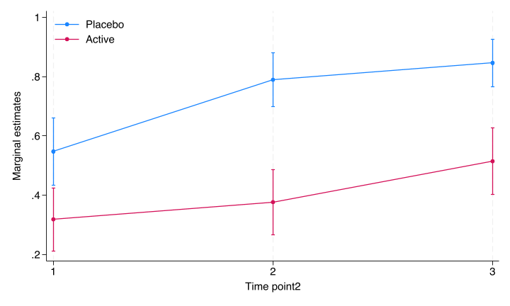

# Dichotomous endpoints

```{r setup_03, include=FALSE}
knitr::opts_chunk$set(echo = TRUE)
library(haven)
library(tidyverse)
library(broom)
library(knitr)
library(purrr)
library(lme4)
library(marginaleffects)
library(emmeans)
library(boot)
library(ggformula)
library(Statamarkdown)
```

## Single follow-up

For a single follow-up assessment of a dichotomous endpoint, the main method I use is a standard logistic regression. Then we can adjust for stratification factors in the randomisation in addition to other pre-specified covariates, both categorical and continuous. In the simulated example, we define that the primary outcome is the dichotomous categorical outcome at time 3. Note that usually the baseline status of all patients are negative for the outcome, so adjusting for baseline is not necessary.

### Stata code

```{stata slogistic1_03, engine.path='/usr/local/bin/stata-se', cache = TRUE, dependson = 'sim'}
use "stata/rct", clear 
tabulate catout trt if time == 3, column
logistic catout i.trt i.site covar  if time==3, coef
```
Note that the use the `coef` option to get the log odds ratio estimates. 
 
### R code

```{r rlogistic1_03}
rct <- read_dta("stata/rct.dta") %>% 
  modify_at(c("trt","catout"), haven::as_factor, levels = "labels") %>% 
  modify_at(c("site","time"), haven::as_factor)
rct %>% 
  filter(time==3) %>%
  glm(catout ~ trt + site + covar , data=., family = binomial) %>%
  summary
```

Not surprisingly, the estimates are identical.


### Reporting
Reporting for dichotomous endpoints is a bit tricky. The natural estimates from a logistic regression is odds and odds ratios, but these are less interpretable than risk differences or relative risk. As New England Journal of Medicine states in their Statistical Guidelines: "Odds ratios should be avoided, as they may overestimate the relative risks in many settings and be misinterpreted." Fortunately, both Stata and R can estimate adjusted risk differences and relative risks from logistic regressions. 

#### Stata code
First we compute the average prediced marginal probabilities. Basically this is done by calculating the predicted probability of a positive outcome for each patient, under both treatments, and then averaging. The standard errors are computed by the delta method. 

```{stata slogistic2_03, engine.path='/usr/local/bin/stata-se', cache = TRUE, dependson = 'sim'}
use "stata/rct", clear 
quietly logistic catout i.trt i.site covar  if time==3, coef
margins trt
```

The adjusted risk difference is calculated similarly.

```{stata slogistic3_03, engine.path='/usr/local/bin/stata-se', cache = TRUE, dependson = 'sim'}
use "stata/rct", clear 
quietly logistic catout i.trt i.site covar  if time==3, coef
margins, dydx(trt)
```

We see that the risk difference is the difference of the estimated marginal probabilities we computed previously. 

The relative risk is a bit more difficult to calculate, but not much. It uses the `nlcom` method to compute non-linear combinations of estimates. 
```{stata slogistic4_03, engine.path='/usr/local/bin/stata-se', cache = TRUE, dependson = 'sim'}
use "stata/rct", clear 
quietly logistic catout i.trt i.site covar  if time==3, coef
quietly margins trt, post
margins, coeflegend
nlcom (ratio1: (_b[1.trt]/_b[0bn.trt]))
```

The trick is to know what goes into the _b[]-brackets, which will be revealed using the `coeflegend´-option. Note that I do not know the properties of this estimator, and it might be clever to check the estimates using bootstrap.

Some journals require calculation of the number needed to treat (NNT), at least if the confidence interval of the adjusted risk difference does not include zero (for which the NNT is undefined). This is simply done by inverting the adjusted risk difference estimate (both point estimate and the confidence limits).

#### R code

The average predicted marginal probabilities was previously not easily computed in R, but with the emergence of the very nice `marginaleffects`-package, this is now much easier:

```{r rlogistic2_3}
mod <- rct %>% 
  filter(time == 3) %>%
  glm(catout ~ trt + site + covar , data=., family = binomial)

mod %>%
  avg_predictions(variables = list(trt = c("Active", "Placebo")), type = "response") 
  
```
We notice that the estimates are equal to the Stata output..

Another option is to bootstrap the predicted marginal predictions:

```{r rlogistic3boot, cache = FALSE}
library(boot)

 fpred <- function(formula, data, indices){
   d <- data[indices,]
   fit <- glm(formula, data = d, family = binomial)
   pred <- prediction(fit,data = d, at = list(trt = c("Active", "Placebo"))) %>%
     as_tibble %>%
     group_by(trt) %>%
     summarise(mean = mean(fitted)) %>%
     ungroup() %>%
     mutate(name = paste0(trt)) %>%
     select(name,mean) %>%
     spread(name,mean) %>%
     as_vector
   return(pred)
 }
 
 data <- filter(rct, time == 3)
 result <- boot(data = data, 
                statistic = fpred, 
                R = 10000, 
                formula = catout ~ trt + site + covar,
                parallel = "multicore",
                ncpus = 4) %>%
   tidy(conf.int = TRUE) 
 
 result %>%
   select(-bias) %>%
   knitr::kable(digits = 3)
```
We see that the estimates are identical to the Stata estimates, although the standard errors and confidence limits are a bit different. But I actually think the bootstrap estimates are better.


The estimated marginal risk difference in R is computed using the `marginaleffects`-package again. 

```{r rlogistic3_03}
 rlogistic <- rct %>% 
  filter(time==3) %>%
  glm(catout ~ trt + site + covar , data=., family = binomial)


  rlogistic %>% 
    avg_comparisons(variables = list(trt = c("Active", "Placebo")), type = "response")
```

We see that the estimates are identical to the Stata estimates. 

The relative risk is very easily computed in R using the `marginaleffects`-package:

```{r rlogistic3_04}
 rlogistic <- rct %>% 
  filter(time==3) %>%
  glm(catout ~ trt + site + covar , data=., family = binomial)


  rlogistic %>% 
    avg_comparisons(variables = list(trt = c("Active", "Placebo")), type = "response", comparison = "ratioavg")
```

The estimate is the inverse of the Stata estimate, and the confidence limits are very similar. There is probably a slight difference in how these are computed. 

This is possible to do also by bootstrapping, but it is a bit more complicated:

```{r rlogistic4boot, cache = FALSE}
library(boot)
library(prediction)


 fpred <- function(formula, data, indices){
   d <- data[indices,]
   fit <- glm(formula, data = d, family = binomial)
   pred <- prediction(fit,data = d, at = list(trt = c("Active", "Placebo"))) %>%
     as_tibble %>%
     group_by(trt) %>%
     summarise(mean = mean(fitted)) %>%
     ungroup() %>%
     mutate(name = paste0(trt)) %>%
     select(name,mean) %>%
     spread(name,mean) %>%
     as_vector
   return(pred["Active"]/pred["Placebo"])
 }
 
 data <- filter(rct, time == 3)
 result <- boot(data = data, 
                statistic = fpred, 
                R = 10000, 
                formula = catout ~ trt + site + covar,
                parallel = "multicore",
                ncpus = 4) %>%
   tidy(conf.int = TRUE) 
 
 result %>%
   select(-bias) %>%
   knitr::kable(digits = 3)
```

## Repeated follow-up

When there are repeated dichotomous endpoints, there are usually two methods available, either the generalized estimating equations method or the generalized mixed model method. I prefer the mixed model approach because it has better missing data properties, and I like that the parameter estimates are interpretable conditional on the subject. In my mind it is more aligned to a causal interpretation. I will show how to do the mixed logistic regression model. We skip the simple model and go straight to a model with treatment-time interaction. Note that usually a dichotomous endpoint all have the same value at baseline (all subjects are in the same state), thus we rarely include the baseline. The model is a simple random intercept model, but it could of course also be expanded to a random intercept and slope model. 

## Treatment-time interaction model

In Stata, the model is coded as:

```{stata sglmm1_03, engine.path='/usr/local/bin/stata-se', cache = TRUE, dependson = 'sim'}
use "stata/rct", clear 
bysort time: tabulate catout trt, column
melogit catout i.trt i.site covar i.time i.trt#i.time if time != 0 || pid: 
```

In R, this model is coded as:
```{r rglmm1_3}
library(lme4)
rct %>%
  filter(time != 0) %>%
  glmer(catout ~ trt + time + trt*time + site + covar + (1|pid), 
        data = ., 
        family = binomial, 
        nAGQ = 7) %>% 
  summary()
```


### Reporting
Plotting i Stata

```{stata sglmm1plot_03, engine.path='/usr/local/bin/stata-se', include=TRUE, cache = TRUE, , dependson = 'sim'}
use stata/rct, clear 
quietly melogit catout i.trt i.site covar i.time i.trt#i.time if time != 0 || pid: 

*Compute the predictive margins by time and treatment

margins time#trt

*Plot the predictive margins. Note that the arguments after the comma is just to prettify the plot.

marginsplot, graphregion(color(white)) graphregion(color(white)) plotregion(color(white)) ytitle("Marginal estimates") ylabel(,nogrid)  legend(region(color(none) lstyle(none)) cols(1) ring(0) bplacement(nwest)) title("")
graph export stata/figures/cat_fig1.png, replace 
```

```{r, out.width="85%", fig.cap="Margins plot by Stata"}

```


The same in R using the `marginaleffects`-package:


```{r rglmm2_03, cache = FALSE}
 
mod <- rct %>%
  filter(time != 0) %>%
  glmer(catout ~ trt + time + trt*time + site + covar + (1|pid), 
        data = ., 
        family = binomial, 
        nAGQ = 7)

pred <- mod %>% 
  avg_predictions(variables = list(trt = c( "Placebo", "Active"), time = c("1","2", "3")), type = "response") 

pred
```
The estimated marginal plot is then given by:
```{r rmixed4plot_02, warning=FALSE}


pred %>% 
  ggplot(aes(time, estimate, color=trt, group=trt)) +
  geom_point(position = position_dodge(0.04)) +
  geom_line() + 
  geom_errorbar(aes(ymin = conf.low, ymax = conf.high), 
                width=.2,
                position = position_dodge(0.04)) + 
  ylab("Estimate") +
  xlab("Time") +
  theme_classic() + 
  theme(legend.position=c(0.1,0.9)) +
  scale_colour_brewer(palette = "Set1", name = "Treatment")


```

The treatment differences at different timepoints are then calculated with:

```{stata sglmm2_03, engine.path='/usr/local/bin/stata-se', cache = TRUE, dependson = 'sim'}
use "stata/rct", clear
quietly melogit catout i.trt i.site covar i.time i.trt#i.time if time != 0 || pid:
margins time, dydx(trt)
```

In R this is done with the `marginaleffects`-package:

```{r rglmm3_03}
mod <- rct %>%
  filter(time != 0) %>%
  glmer(catout ~ trt + time + trt*time + site + covar + (1|pid), 
        data = ., 
        family = binomial, 
        nAGQ = 7)

mod %>%
  avg_comparisons(variables = list(trt = c("Active", "Placebo")), by = "time", type = "response", re.form = NA)

```
We see the results are slightly different to the Stata results, but the differences are small.


